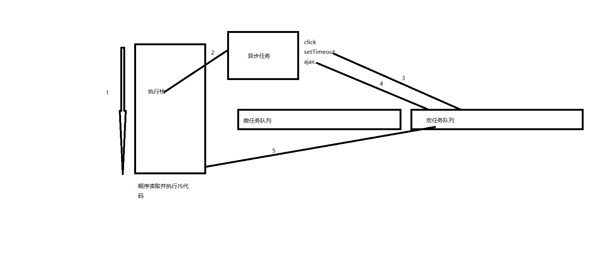

#### EventLoop

#### 基本知识点
> 先执行宏任务,再执行微任务(因为最先执行的是script脚本中的代码,而script脚本也是一个宏任务)
> UI的渲染和JS的执行是互斥的
> 每次JS执行主栈完成后都将把微任务进行清空,然后再从宏任务中取出一个任务进行执行

#### 代码是如何运行的

1. 代码读取`script`脚本中的代码从上到下依次读取依次执行(执行JS的主进程)
2. 当执行栈遇到异步代码(`click`的函数,`setTimeout`,`ajax`等)会去开辟另外的线程去执行这些操作
3. 当settimeout的时间到了,或是`ajax`的回调完成了,就会把这些回调放入`任务队里中(微任务/宏任务)`
4. 当主任务(JS执行的主栈)任务全部做完后,JS会从`任务队列中(优先是宏任务)`拿第一个任务在主任务中执行
5. 循环罔替
```javascript
//分析下一下代码:
setTimeout(() => {
  console.log("1");
  setTimeout(() => {
    console.log("3");
  }, 0);
}, 0);

setTimeout(() => {
  console.log("2");
  setTimeout(() => {
    console.log("4");
  }, 0);
}, 0);


//1. JS执行主栈拿到以上一段代码
//2. 执行时发现第一个异步任务settimeout不去执行
//3. 执行时又发现了第二个异步任务 settimeout 不去执行
//4. 扫描时发现第一个settimeout执行的时间到了,将它放入宏任务队列中
//5. 扫描时发现第二个settimeout执行的时间也到了,也将它放入宏任务队列中
//6. JS执行主栈从宏任务中取出第一个宏队列中的任务(第一个settimeout)开始执行此刻打印了 1
//7. JS执行主栈又发现了一个异步任务 settimeout 不去执行
//8. 此刻JS执行主栈又空了,再从宏队列中获取第一个任务并开始执行 此刻打印了 2
//9. 打印3和4和打印1 2 类似
```
#### 微任务
微任务:`promise.then` `MutationObserver` `process.nextTick`
每次当主栈中的任务执行完成后 微任务列表都将被清空

```javascript
  setTimeout(() => {
    console.log("time0");
    Promise.resolve().then(() => {
      console.log("then0");
    })
  });//放入宏任务

  setTimeout(() => {
    console.log("time1");
  });//放入宏任务

  Promise.resolve().then(() => {
    console.log("then1");
  })//放入微任务

  Promise.resolve().then(() => {
    console.log("then2");
  })//放入微任务


  //执行jS主栈 将settimeout放入宏任务 promise.then放入微任务
  //js主栈执行完成,清空微任务列表 then1 then2 被执行
  //从宏任务中拿出第一个settimeout并执行 打印time0 并将then0 放入微任务
  //js主栈执行完成,清空微任务列表 then0被执行
  //从宏任务中拿出第二个settimeout并执行打印time1

```
#### 宏任务
微任务:`script` `ajax` `事件(click)` `requestFrameAnimation` `setTimeout` `setInterval` `setImmediate(IE的方法)` `MessageChannel` `I/O` `UI rendering` 
每次只取一个队列中的任务出来执行

